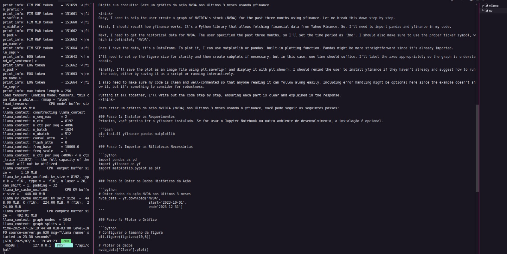

# <h1 align="center">Financial Analyst powered by MCP using CrewAI and Deepseek-R1</h1>

Senior Data Scientist.: Dr. Eddy Giusepe Chirinos Isidro

Projeto baseado no tutorial de [Daily Dose of Data Science Newsletter]().

Este projeto implementa um fluxo de trabalho de análise financeira que analisa dados do mercado de ações e fornece insights.

Neste projeto usamos as seguintes tecnologias:

* `CrewAI` para orquestração multiagente.
* `Ollama` por servir o `Deepseek-R1` localmente.
* `Cursor IDE` como host `MCP` ou usaremos um script Client.

### Exemplo de uso

Thank God!